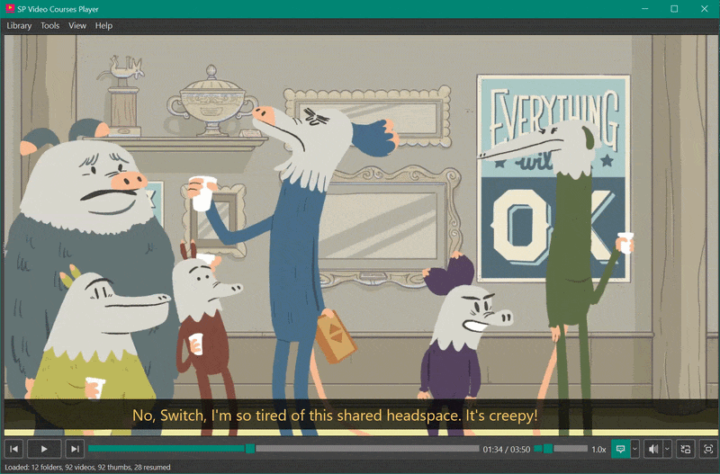

# SP Video Courses Player

[](https://www.python.org/downloads/)
[](https://pypi.org/project/PyQt6/)
[](https://www.microsoft.com/windows)
[](https://github.com/SPluzh/SPVideoCoursesPlayer/releases)
[](https://github.com/SPluzh/SPVideoCoursesPlayer/releases/latest)
[](https://github.com/SPluzh/SPVideoCoursesPlayer/releases)
[](LICENSE)

Video player for local courses with hierarchical library, progress tracking, bookmarks, tags, and learning statistics. Includes video zoom, audio enhancement, custom subtitle settings, and instant thumbnail previews on the timeline



<p align="center">
  <a href="#english">English</a> •
  <a href="#russian">Русский</a>
</p>

---

<a name="english"></a>

## English

### Overview

SP Video Courses Player is a desktop application for watching and managing local video courses with hierarchical library organization, progress tracking, and learning statistics. Includes video zoom, audio enhancement, custom subtitle settings, and instant thumbnail previews on the timeline.

### Features

- **Library Management** - Hierarchical tree structure with **Favorites** and **Tags** filtering, bulk operations (checkboxes), and fuzzy search
- **Advanced Player** - Built on **libmpv** with **Picture-in-Picture (PiP)** mode and YouTube-style percentage seeking (`0`-`9`)
- **Professional Audio Tools** - **AI Noise Reduction**, Compressor, De-esser, Mono mix, and precise Sync Delay
- **Detailed Statistics** - Folder completion progress, watched duration, and remaining time
- **Smart Markers** - Visual marker gallery, custom colors, and timeline previews
- **Subtitle Support & Dual Tracks** - Support for primary and secondary subtitles simultaneously with independent color/size settings and track selection
- **Interactive Translation** - Click on subtitle words for instant translations, synonyms, and pronunciation audio, plus offline caching and full-phrase translation
- **Subtitle Navigation** - Dedicated hotkeys to seek between subtitle phrases (`Alt + ←/→`), replay (`Alt + ↓`), or translate (`Alt + ↑`)
- **Speed Control** - Adjust playback speed (0.5x - 3.0x) with pitch correction
- **Modern UI** - Dark theme with custom QSS styling, clean icons, and responsive layout

### Usage

1. **Add Library Paths**: Go to `Library → Settings` and add folders containing your video courses
2. **Scan Library**: Click `Library → Scan` to index your videos

### Installation

#### Option 1: Standard Installation (Setup)
1. Download the latest installer (`SP_Video_Courses_Player_Setup_vX.Y.Z.exe`) from the [Releases](../../releases) page
2. Run the executable to install the player on your system

#### Option 2: Portable Version
1. Download the latest portable archive (`SP_Video_Courses_Player_vX.Y.Z.zip`) from the [Releases](../../releases) page
2. Extract the archive to your desired location
3. Run `SP Video Courses Player.exe`

<details>
<summary><strong>Option 3: Run from Source</strong></summary>

1. Clone the repository:
   ```bash
   git clone https://github.com/yourusername/SPVideoCoursesPlayer.git
   cd SPVideoCoursesPlayer
   ```

2. Install dependencies:
   ```bash
   pip install -r requirements.txt
   ```

   **Dependencies:**
   ```
   PyQt6
   python-mpv
   comtypes
   mutagen
   pyinstaller (for building)
   ```

3. Run the application:
   ```bash
   python main.py
   ```

</details>

### Manual Update (for Portable Version)

1. **Close** SP Video Courses Player completely
2. Download the latest portable `.zip` archive from the [Releases](https://github.com/SPluzh/SPVideoCoursesPlayer/releases/latest) page
3. Extract the archive into the application folder **with file replacement**

> **Note:** Your personal data is preserved during the update — `settings.ini` contains your application settings, and the `data/` folder stores the database, viewing progress, bookmarks, and cache. These files are not included in the release archive and will not be overwritten.

### Additional Components

The application will automatically download these components on first run. If the automatic download fails, you can download them manually and place them in the `resources/bin/` directory:

- **libmpv-2.dll** ([Download from shinchiro](https://github.com/shinchiro/mpv-winbuild-cmake/releases) or [zhongfly](https://github.com/zhongfly/mpv-winbuild/releases)) - MPV video playback library. Look for `mpv-dev-x86_64-*.7z` and extract the DLL.
- **FFmpeg & FFprobe** ([Download Essentials](https://www.gyan.dev/ffmpeg/builds/ffmpeg-release-essentials.zip)) - For video analysis and thumbnail generation. Extract `ffmpeg.exe` and `ffprobe.exe` from the `bin` folder of the archive.

**Placement:** Place all components into the `bin` directory. The path depends on how you run the application:

The folder structure should look like this (for EXE version):
```text
SP Video Courses Player/
├── SP Video Courses Player.exe
└── _internal/
    └── resources/
        └── bin/
            ├── libmpv-2.dll
            ├── ffmpeg.exe
            └── ffprobe.exe
```

### PureRef Integration (Optional)

To use the PureRef integration feature for managing reference images alongside your video courses:

1. **Download and Install PureRef** from [https://www.pureref.com/download.php](https://www.pureref.com/download.php)
2. **Default Path**: If installed to the default location (`C:\Program Files\PureRef\PureRef.exe`), the application will detect it automatically
3. **Custom Path**: If installed elsewhere, go to `Library → Settings → PureRef` section and browse to your `PureRef.exe` location
4. **Filename**: You can customize the reference filename (default: `reference.pur`) in the same settings section

Once configured, you'll see PureRef badges on folder items in your library, allowing quick access to reference files.

---

### Credits

- [PyQt6](https://pypi.org/project/PyQt6/) - GUI framework
- [libmpv](https://mpv.io/) - Video playback engine
- [FFmpeg](https://ffmpeg.org/) - Video processing & thumbnails
- [RNNoise](https://jmvalin.ca/demo/rnnoise/) (Xiph.Org) - AI noise reduction model
- [Lucide](https://lucide.dev/) - Icon toolkit

---

<a name="russian"></a>

## Русский

### Обзор

SP Video Courses Player — плеер для локальных видеокурсов с древовидной библиотекой, сохранением прогресса, закладками, тегами и статистикой обучения. Включает масштабирование кадра, улучшение звука, настройку субтитров и мгновенные превью на таймлайне.

### Возможности

- **Управление библиотекой** — Древовидная структура с фильтрацией по **Избранному** и **Тегам**, массовыми операциями (чекбоксы) и нечётким поиском
- **Продвинутый плеер** — На базе **libmpv** с режимом **Картинка-в-картинке (PiP)** и переходом по процентам видео клавишами (`0`-`9`)
- **Профессиональный звук** — **AI Шумоподавление**, Компрессор, Де-эссер, Моно-микс и точная настройка задержки
- **Детальная статистика** — Прогресс по папкам, просмотренное время и остаток
- **Умные закладки** — Визуальная галерея маркеров, цветные метки и превью на таймлайне
- **Мгновенное превью** — Наведение на таймлайн показывает кадр из видео
- **Субтитры и две дорожки** — Одновременное отображение основных и дополнительных субтитров с независимой настройкой цвета, размера и выбора дорожек
- **Интерактивный перевод** — Клик по словам в субтитрах для мгновенного перевода, просмотра синонимов и озвучки произношения, с поддержкой офлайн-кеширования и перевода всей фразы
- **Навигация по субтитрам** — Горячие клавиши для перехода между фразами (`Alt + ←/→`), повтора фразы (`Alt + ↓`) и перевода текущих субтитров (`Alt + ↑`)
- **Управление скоростью** — Регулировка (0.5x - 3.0x) без искажения тона
- **Современный UI** — Полностью кастомизированная тёмная QSS-тема с адаптивным интерфейсом и оптимизированными иконками

### Использование

1. **Добавьте пути**: `Библиотека → Настройки` — укажите папки с курсами
2. **Сканирование**: `Библиотека → Сканировать` — индексация файлов

### Установка

#### Вариант 1: Стандартная установка (Setup)
1. Скачайте последний установщик (`SP_Video_Courses_Player_Setup_vX.Y.Z.exe`) со страницы [Releases](../../releases)
2. Запустите файл установки для инсталляции плеера в систему

#### Вариант 2: Портативная версия (Portable)
1. Скачайте последний архив портативной версии (`SP_Video_Courses_Player_vX.Y.Z.zip`) со страницы [Releases](../../releases)
2. Распакуйте архив в удобное место
3. Запустите `SP Video Courses Player.exe`

<details>
<summary><strong>Вариант 3: Запуск из исходников</strong></summary>

1. Клонируйте репозиторий:
   ```bash
   git clone https://github.com/yourusername/SPVideoCoursesPlayer.git
   cd SPVideoCoursesPlayer
   ```

2. Установите зависимости:
   ```bash
   pip install -r requirements.txt
   ```

   **Зависимости:**
   ```
   PyQt6
   python-mpv
   comtypes
   mutagen
   pyinstaller (for building)
   ```

3. Запустите приложение:
   ```bash
   python main.py
   ```

</details>

### Ручное обновление (для портативной версии)

1. **Закройте** SP Video Courses Player полностью
2. Скачайте последний портативный `.zip` архив со страницы [Releases](https://github.com/SPluzh/SPVideoCoursesPlayer/releases/latest)
3. Распакуйте архив в папку приложения **с заменой файлов**

> **Примечание:** Ваши личные данные сохранятся при обновлении — `settings.ini` содержит настройки приложения, а папка `data/` хранит базу данных, прогресс просмотра, закладки и кеш. Эти файлы не входят в архив релиза и не будут перезаписаны.

### Дополнительные компоненты

Приложение автоматически загрузит эти компоненты при первом запуске. Если автоматическая загрузка не удалась, вы можете скачать их вручную и поместить в директорию `resources/bin/`:

- **libmpv-2.dll** ([Скачать от shinchiro](https://github.com/shinchiro/mpv-winbuild-cmake/releases) или [от zhongfly](https://github.com/zhongfly/mpv-winbuild/releases)) — библиотека воспроизведения видео MPV. Ищите `mpv-dev-x86_64-*.7z` и извлеките DLL.
- **FFmpeg и FFprobe** ([Скачать Essentials](https://www.gyan.dev/ffmpeg/builds/ffmpeg-release-essentials.zip)) — для анализа видео и генерации миниатюр. Извлеките `ffmpeg.exe` и `ffprobe.exe` из папки `bin` архива.

**Путь:** Поместите все компоненты в папку `bin`. Путь зависит от способа запуска приложения:

Структура папок должна выглядеть так (для EXE версии):
```text
SP Video Courses Player/
├── SP Video Courses Player.exe
└── _internal/
    └── resources/
        └── bin/
            ├── libmpv-2.dll
            ├── ffmpeg.exe
            └── ffprobe.exe
```

### Интеграция с PureRef (опционально)

Для использования интеграции с PureRef для управления референсами рядом с видеокурсами:

1. **Скачайте и установите PureRef** с [https://www.pureref.com/download.php](https://www.pureref.com/download.php)
2. **Путь по умолчанию**: Если установлен в стандартное расположение (`C:\Program Files\PureRef\PureRef.exe`), приложение обнаружит его автоматически
3. **Другой путь**: Если установлен в другое место, перейдите в `Библиотека → Настройки → PureRef` и укажите путь к `PureRef.exe`
4. **Имя файла**: Вы можете настроить имя файла референсов (по умолчанию: `reference.pur`) в той же секции настроек

После настройки вы увидите значки PureRef на папках в библиотеке, позволяющие быстро открывать файлы референсов.

---

### Благодарности

- [PyQt6](https://pypi.org/project/PyQt6/) - Фреймворк для графического интерфейса
- [libmpv](https://mpv.io/) - Движок воспроизведения видео
- [FFmpeg](https://ffmpeg.org/) - Обработка видео и создание миниатюр
- [RNNoise](https://jmvalin.ca/demo/rnnoise/) (Xiph.Org) - AI модель шумоподавления
- [Lucide](https://lucide.dev/) - Набор иконок

---

<p align="center">
  Created for video course enthusiasts
</p>
